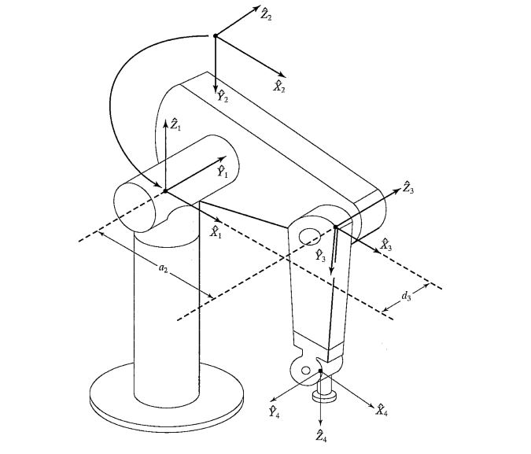
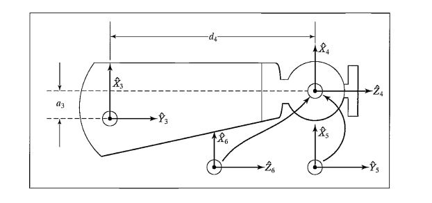
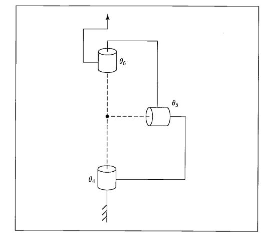
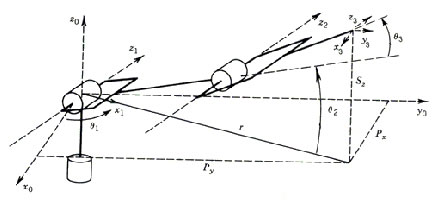
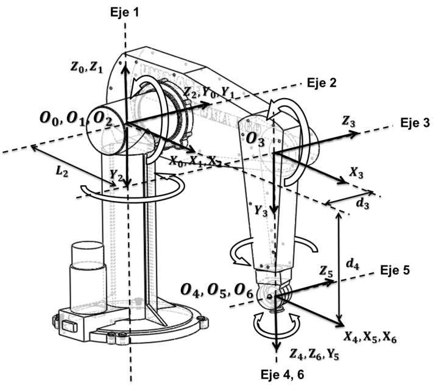
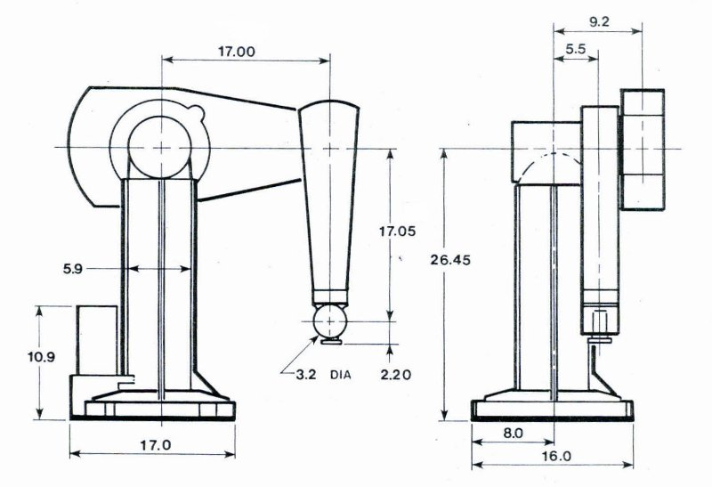
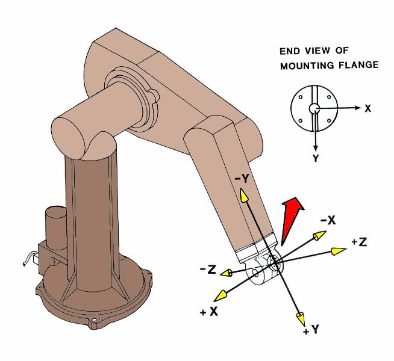
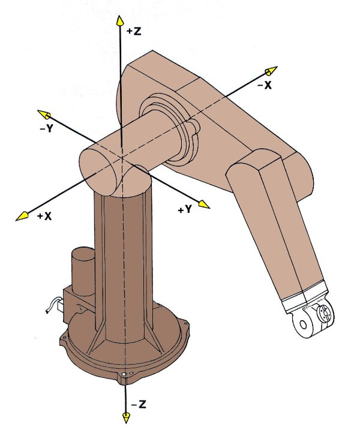

# Introduction

The PUMA 560 is a industrial robot arm with six degrees of freedom and all rotational joints. In this experiment at first a brief theory about PUMA 560 robot is presented in the theory section. The theory for mathematical computations was obtained from a wide variety of sources encompassing books, papers and internet. In simulation section a virtual model is developed in javascript program which is used to investigate the forward kinematics problem. For more information on other aspects of PUMA 560 and robotics visitors are advised to follow the references.

***Figure 1: PUMA 560***

# Theory
- Programmable Universal Machine for Assembly, more popularly known as PUMA is an industrial robot arm developed by Victor Scheinman at Unimation, in the year 1978. PUMA comes in various makes viz. PUMA 260, PUMA 560, PUMA 761 etc. Figure 2 shows link-frame assignments in the position corresponding to all joint angles equal to zero. Here the frame {0} (not shown) is coincident with frame [1} when is zero. Note also that, for this robot, as for many industrial robots, the joint axes of joints 4, 5, and 6 all intersect at a common point, and this point of intersection coincides with the origin of frames {4}, {5}, and {6}. Furthermore, the joint axes 4, 5, and 6 are mutually orthogonal. This wrist mechanism is illustrated schematically in Fig.4. In this experiment forward kinematics of PUMA 560 is described through a virtual model. The forward kinematics problem is concerned with the relationship between the individual joints of the robot manipulator and the position and orientation of the tool or end effector. 

## General Terminology in Robotics:

### Workspace:

The reachable workspace of a robot's end-effector is the manifold of reachable frames.

### Accuracy:

Accuracy refers to a robot's ability to position its wrist end at a desired target point within the work volume, and it is defined in terms of spatial resolution. It depends on the technology and the control increments.

### Repeatability:

Repeatability is a statistical term associated with accuracy. If a robot joint moves by the same angle from a certain point a number of times, all with equal environmental conditions, the target is always missed by a large margin. If the same error is repeated, then we say that the repeatability is high and the accuracy is poor.

### Safety:

The ability to reduce the human-robot impact force and ensure human safety is a fundamental requirement for human-friendly robots.

### Forward Kinematics :

Forward kinematics (FK) mainly deals with constructing a Denavit-Hartenberg (D-H) transformation matrix with Puma's parameters obtained from a D-H parameter table shown below: 

***Figure 2: Kinematic parameters and frame assignments for the PUMA 560 manipulator.***

***Figure 3: Kinematic parameters and frame assignments for the forearm of the PUMA 560 manipulator.***

***Figure 4: Schematic of a 3R wrist in which all three axes intersect at a point and are mutually orthogonal.***

***Table 1. Puma 560 D-H parameter table***

| $$ Link_i $$ | $$	\\alpha_{i-1} $$ | $$ a_{i-1}(m) $$ | $$ d_i (m) $$ | $$ \\theta_i $$ |
| :-- | :-- | :-- | :-- | :-- |
| $$ 1 $$ | $$ 0 $$ | $$ 0 $$ | $$ 0 $$ | $$ \\theta_1 $$ |
| $$ 2 $$ | $$ -90 $$ | $$ 0 $$ | $$ 0 $$ | $$ \\theta_2 $$ |
| $$ 3 $$ | $$ 0 $$ | $$ a_2 $$ | $$ d_3 $$ | $$ \\theta_3 $$ |
| $$ 4 $$ | $$ -90 $$ | $$ a_3 $$ | $$ d_4 $$ | $$ \\theta_4 $$ |
| $$ 5 $$ | $$ 90 $$ | $$ 0 $$ | $$ 0 $$ | $$ \\theta_5 $$ |
| $$ 6 $$ | $$ -90 $$ | $$ 0 $$ | $$ 0 $$ | $$ \\theta_6 $$ |

**Transformation matrices of six joints for Puma 560 robot**

$$ T_1 = \\begin{bmatrix} cos(\\theta_1) & -sin(\\theta_1) & 0 & 0 \\\ sin(\\theta_1) & cos(\\theta_1) & 0 & 0 \\\ 0 & 0 & 1 & 0 \\\ 0 & 0 & 0 & 1 \\\ \\end{bmatrix} \\quad T_2 = \\begin{bmatrix} cos(\\theta_2) & -sin(\\theta_2) & 0 & 0 \\\ 0 & 0 & 1 & 0 \\\ -sin(\\theta_2) & -cos(\\theta_2) & 0 & 0 \\\ 0 & 0 & 0 & 1 \\\ \\end{bmatrix} $$

$$ T_3= \\begin{bmatrix} 
cos(\\theta_3) & -sin(\\theta_3) & 0 & a_2 \\\
sin(\\theta_3) & cos(\\theta_3) & 0 & 0 \\\
0 & 0 & 1 & d_3 \\\
0 & 0 & 0 & 1 \\\
\\end{bmatrix}

T_4 = \\begin{bmatrix} 
cos(\\theta_4) & -sin(\\theta_4) & 0 & a_3 \\\
0 & 0 & 1 & d_4 \\\
-sin(\\theta_4) & -cos(\\theta_4) & 0 & 0 \\\
0 & 0 & 0 & 1 \\\
\\end{bmatrix} $$

$$ T_5 = \\begin{bmatrix} 
cos(\\theta_5) & -sin(\\theta_5) & 0 & 0 \\\
0 & 0 & -1 & 0 \\\
sin(\\theta_5) & cos(\\theta_5) & 0 & 0 \\\
0 & 0 & 0 & 1 \\\
\\end{bmatrix}

T_6 = \\begin{bmatrix} 
cos(\\theta_6) & -sin(\\theta_6) & 0 & 0 \\\
0 & 0 & 1 & 0 \\\
-sin(\\theta_6) & -cos(\\theta_6) & 0 & 0 \\\
0 & 0 & 0 & 1 \\\
\\end{bmatrix} $$

**Final Transformation Matrix**

$$ T = T_1 * T_2 * T_3 * T_4 * T_5 * T_6 $$

The orientation and position of the end effector with reference to the base coordinate is obtain from the final matrix 
$$ T = \\begin{bmatrix}
n & s & a & p \\\
0 & 0 & 0 & 1 \\\
\\end{bmatrix} = \\begin{bmatrix}
n_x & s_x & a_x & p_x \\\
n_y & s_y & a_y & p_y \\\
n_z & s_z & a_z & p_z \\\
0 & 0 & 0 & 1 \\\
\\end{bmatrix} $$

### Puma kinematic diagrams

***Figure 5: Simplified drawing of first three links of Puma 560 with transformation frames appropriately***

# Video

***PUMA560 Industrial Robot***

<video width="420" height="340" controls="" autoplay=""><source src="./images/puma560.mp4" type="video/mp4"></video>

